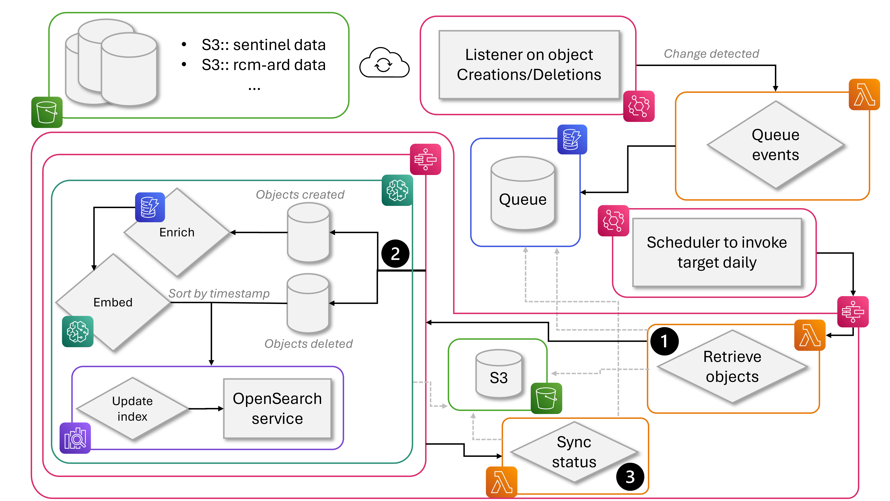

# AutoUpdater Pipeline for OpenSearch
This guide details the end-to-end process for how the autoupdater syncs changes to documents in S3 buckets to the documents indexed in Opensearch and its alternative use cases. The pipeline is housed in AWS and all development code is available in the Cloud9 environment titled `geocore-semantic-search-lambda-code`.

Contacts: 
- Svetlana Esina: `svetlana.esina@nrcan-rncan.gc.ca`
- Bo Lu: `bo.lu@NRCan-RNCan.gc.ca`

## Table of Contents
* [Overview](#overview)
    * [1. Event Accumulator](#event-accumulator)
    * [2. Main AutoUpdater Pipeline](#main-autoupdater-pipeline)
        * [Using AutoIndexer manually for document indexing](#using-autoindexer-manually-for-document-indexing)
* [Development Environment](#development-environment)
    * [Updating images on ECR for Lambdas](#updating-images-on-ecr-for-lambdas)
    * [Updating Lambda zip files](#updating-lambda-zip-files)
* [Troubleshooting](#troubleshooting)

---
# Overview

The pipeline is split into 2 major steps:
1. **Recording any changes to the datasets that transpired over some period of time** alongside event details like type of event (i.e. creation/modification/deletion), the object affected, and the time of occurance
2. **Processing these events** which involves enriching the object data, embedding the document metadata text, uploading the changes to the corpus to Opensearch. In the diagram, this step is further split into 3 stages (steps 2.1, 2.2, 2.3) which we will go in depth into in this guide.



*Why do we need step 1?* Step 1 acts as an accumulator of all events that need to be processed and it is necessary in order to justify the cost associated with step 2. Step 2 uses a Sagemaker processing job - these jobs take a while to spin up and a while to finish processing as resources are being allocated, libraries are being loaded and volumes are being mounted. In order to justify this associated overhead, we need to ensure that we are processing large enough batches of object changes. Hence, it is essential to have a preliminary step to hold these events in a "queue" until the processing step is triggered.

*What triggers step 2?* Step 2 is triggered via an EventBridge schedule - a cron-like rule that invokes a target at set intervals of time. Specifically, it is currently invoking the processing step daily at 23:45-00:00, to allow changes to both accumulate and be processed in a timely manner. However, if a prompt trigger of the pipeline is required, an execution run of the AutoUpdater step function can be manually triggered as well.


## Event Accumulator

**EventBridge Rule**: In order to listen to object changes in the S3 buckets, an EventBridge rule is used. This rule tracks object creations - new creations or modifications to existing objects - and object deletions.

**Lambda RecordObjectUpdate**: Upon detecting a change, a lambda function is invoked to appropriately transform the event and store it in a queue. The transformations in question are minor: extract relevant details and setting the processing status to `QUEUED`. 
- This lambda function's name typically contains `RecordObjectUpdate` and its code is stored in a zip in a cloudformation deployment files S3 bucket under lambda.

**DynamoDB TableIndexUpdates**: The queue itself is implemented through a DynamoDB table with the object Id acting as a unique partition key. A separate index involving the status (e.g. `QUEUED`) as the partition key and the updatedAt timestamp (i.e. when the event was fired) as the sort key to later be able to efficiently retrieve all pending/queued documents. Events arriving with the same object Id override any existing event with the same object Id, to ensure only the latest change is kept for processing.

The queue doubles as an opportunity to correct any errors that may have transpired throughout the pipeline. Events with a non-QUEUED status reveal at what point the object failed in the pipeline.
- `ERROR_ON_LOAD`: Object failed in Step 2.1 where the affected object needed to be retrieved for processing. A likely cause is a desync from the Table events and the S3 bucket contents, e.g. scheduler was stopped for some time and a previously queued Object Creation event was  followed by a deletion that was not captured. If the object is no longer required in the Opensearch index, the row can be deleted from the Table, or otherwise, the object can be added back manually into the appropriate S3 bucket and the status in the Table needs to be changed to `QUEUED` to enable it to be processed in the next pipeline trigger.
- `ERROR_ON_SYNC`: Object failed in Step 2.2 where the affected object needed to be processed, embedded, and uploaded to the Opensearch index. A common case for this error is the creation and deletion of an object within the same day, causing the deletion request in Opensearch to fail on document to delete not being found. Alternatively, if it is any other error, please consult the processing job's logs for information. Similarly to the previous error, the object can be removed from the table or requeued on a case-by-case basis.

## Main AutoUpdater Pipeline

**S3 StoreUpdatesBucket**: The place that logs all updates and embeddings completed for the last month is this S3 bucket. It allows for manual updates of embeddings in the Opensearch index for easier recovery in desync cases. The lifecycle management rule ensures files within the bucket "expire" or are removed after 30 days; however, this can be extended under the `Management` tab on the S3 bucket itself (on AWS GUI).

**Lambda ExtractAffectedObjects**: The loading of all relevant objects and their data is completed via the Lambda in Step 2.1. The Lambda communicated with the DynamoDB queue and based on the events captured there prepared the relevant data: newly created or modified objects get pulled from their respective S3 buckets, while deleted objects just get forwarded in the same format.
- This function saves a `corpus` update file with a timestamp in the S3 StoreUpdatesBucket.
- The code responsible for this function is stored in a Docker image on ECR: 
```
semantic-search-auto-embed-python310-lambda-stage
```

**StepFunction AutoIndexer**: Step 2.2 revolves around processing, embedding and syncing all the new files with the Opensearch index. All components in this step are offset in a separate StepFunction in order to allow more flexibility for its use: e.g. the step function can be triggered manually on an index to complete the initial load of all documents into a particular index, or to complete an sync of the documents within a parquet and an Opensearch index.

**ProcessingJob ProcessAndEmbedRecords**: The main powerhouse responsible for the processing, embedding and uploading of documents is this Sagemaker Processing Job. It runs on an EC2 instance in the background and, unlike a Lambda, it has no 15-min restriction for its runtime. However, it does take a bit to spin up as it additionally mounts input and output S3 buckets into a local filesystem, allowing access to them through code. The python code behind this processing function separates the creation and deletion objects, processes (normalized temporal end time, enriches with geotheme from DynamoDB tables, etc.) and embeds (calls inference code from model behind the Sagemaker model endpoint) the creation ones before combining them back with the deletions - sorted by timestamp - to be bulk uploaded onto Opensearch. 
- Deletion of documents relies on the filename to match the id of the record itself!
- All code is pulled from a Docker image on ECR:
```
semantic-search-auto-embed-processing-job
```
- Permissions granted to the role executing on opensearch are least-privilege and are defined in both the AWS IAM role and FGAC role on the Security tab on the Opensearch dashboard:
```
https://dashboard.search-recherche.geocore-stage.api.geo.ca/_dashboards/app/dashboards#/
```
- Opensearch currently houses `gte-multi-ft` and `gte-multi-ft2` indicies that point to the best performing model on both EN and FR from the initial experiment and the best performing model on the 2026-08-11 data, respectively.
- In order to embed large batches faster, instead of the model endpoint being called, the model is loaded locally and the inference code stored in it is referenced directly, avoiding any network throttling. Within the docker image, this part of the logic is offset to the `model_inference` module.
- This step saves `embeddings` for all embedded created/modified files and `autoindex` for successful and failed uploads in the S3 StoreUpdatesBucket.
- Processing job timeout is set to 6 hours (21600 seconds). If more is required, update the value in the cloud formation yaml.

**Lambda PostUpdateSync**: Step 2.3 is concerned with maintaining the AutoUpdater pipeline for future retriggers. It cleans up any processed documents from the queue and marks those with errors. Any files that were modified since the start of the pipeline's execution will not be overriden by this lambda function. Object with errors will contain an error message in the `status` field on the queue, `lastUpdatedAt` will reflect the time when the last executed processing attempt was made.
- Its code is available as a zip in a cloudformation deployment files S3 bucket under lambda.


### Using AutoIndexer manually for document indexing
To use the AutoIndexer for manual document indexing, you need to satisfy 2 criteria:
1. *The data to be uploaded is in the expected format.* All the documents to be uploaded need to be contained within a single `.parquet` file with 2 additional columns: `lastAction` which is either `Object Created` or `Object Deleted` and `updatedAt` which contains the timestamp for the request e.g. `2026-09-08T12:12:43Z`. You can use the `manual_autoindex/create_corpus.py` script available on Cloud9 for reference. As a final step, you'll be required to upload this file to an S3 bucket; S3 StoreUpdatesBucket would be appropriate for this. If you choose to change the S3 bucket, you'll need to additionally change the mounted bucket on the processing jobs arguments.
2. *The statemachine is called with the proper parameters.* The proper parameter call for the state machine follows the format:
```json
{
  "corpusS3Path": "corpus-2026-09-08T13:33:01Z.parquet", # name of file with all documents to process, emdbed and upload
  "modelEndpointName": "gte-multi-ft-se", # name of Sagemaker endpoing to use for embedding
  "osIndex": "gte-multi-ft-test", # name of Opensearch index to make updates to
  "osIndexCreate": "false", # flag to create the Opensearch index if it doesnt exist yet (true) or not (false)
  "region": "ca-central-1" # region of Opensearch domain
}
```

If you kickstart the state machine, it will not be marked as completed until the processing job is completed as well. Cost-wise this is not an issue as state machine pricing is based on the number of state transitions rather than the time it takes to run them.

Note that you may need to add any new model endpoint access permissions into the associated IAM role if not using the default provided by the stack deployment.

#### Alternative document indexing
You can use the Demo4 notebook from the semantic-search-with-amazon-opensearch repository as a guide to process and embed the documents and unpload them for a particular index manually.

## Deleting dataset from file with different name
One of the main assumptions of this pipeline is that the filename of the `.geojson` dataset must match the id of the dataset itself in order for delete to work. However, even if previously a dataset was uploaded belonging to a differently-named file, you can still delete the dataset through some manual effort. Specifically:
1. Record a copy of the actual dataset id you want to remove
2. Manually create an item in the DynamoDB table with the following parameters:

```json
{
  "objectId": {
    "S": "id-of-dataset"
  },
  "status": {
    "S": "QUEUED"
  },
  "lastAction": {
    "S": "Object Deleted"
  },
  "updatedAt": {
    "S": "id-of-dataset"
  },
}
```

# Development Environment
The development environment used to create all the components for the autoupdater pipeline involves AWS GUI on the `stage` environment and Cloud9 instance `geocore-semantic-search-lambda-code`. Specifically, the AWS GUI was used to construct the communication between the Saas components before moving them into a Cloudformation `.yaml`, while the Cloud9 instance houses all the development code edits to formulate the logic behind the components.

## Updating images on ECR for Lambdas
For all lambda code that is containerized through Docker and pulled through ECR, the following instructions can be used to update the images:
1. Before running any AWS-CLI command on the Cloud9 console, declare the AWS account credentials by simply pasting them into the console. You can run a check that you're properly logged in via
    ```
    aws sts get-caller-identify
    ``` 
    If there is an error returned, or just want to reauthenticate, you may need to delete any `~/.aws/credentials` files (they are created automatically when aws-cli attempts to authenticate through Cloud9) before re-declaring the AWS credentials.
2. For easier command runs, declare some extra environment variables that will dictate what ECR repository you want to push to, in what region associated with what account:
    ```
    export AWS_ACCOUNT_ID=""
    export AWS_REGION="ca-central-1"
    export REPO_NAME="semantic-search-auto-embed-processing-job"
    ```
3. [Optional] Create the ECR repository
    ```
    aws ecr create-repository --repository-name $REPO_NAME
    ```
4. Authenticate Docker to ECR
    ```
    aws ecr get-login-password --region $AWS_REGION | \
    docker login --username AWS --password-stdin $AWS_ACCOUNT_ID.dkr.ecr.$AWS_REGION.amazonaws.com
    ```
5. Build your Docker image (you need to be in the same directory as your Dockerfile). Match the architecture to the one used by your Lambda (x86_64 shown in this example)
    ```
    docker build --platform linux/amd64 -t $REPO_NAME .
    ```
6. Tag your image as latest
    ```
    docker tag $REPO_NAME:latest $AWS_ACCOUNT_ID.dkr.ecr.$AWS_REGION.amazonaws.com/$REPO_NAME:latest
    ```
7. [Optional] Test the image before pushing
    ```
    docker run --rm $AWS_ACCOUNT_ID.dkr.ecr$AWS_REGION.amazonaws.com/$REPO_NAME:latest python3 process.py
    ```
    or with arguments
    ```
    docker run --rm -v /home/ec2-user/environment/test/input:/opt/ml/processing/input -v /home/ec2-user/environment/test/output:/opt/ml/processing/output -e TEST_VARIABLE=test $AWS_ACCOUNT_ID.dkr.ecr$AWS_REGION.amazonaws.com/$REPO_NAME:latest
    ```
8. Push to ECR
    ```
    docker push $AWS_ACCOUNT_ID.dkr.ecr.$AWS_REGION.amazonaws.com/$REPO_NAME:latest
    ```

Note that you will be required to deploy the new image on the Lambda on AWS itself - it will not automatically pull the latest image without you prompting it to.

----
Other useful Docker commands:
- Pull image from ECR
    ```
    docker pull $AWS_ACCOUNT_ID.dkr.ecr.$AWS_REGION.amazonaws.com/$REPO_NAME:latest
    ```
- Navigate inside image
    ```
    docker run --rm -it --entrypoint sh $AWS_ACCOUNT_ID.dkr.ecr.$AWS_REGION.amazonaws.com/$REPO_NAME:latest
    ```
- Clear untagged images
    ```
    docker image prune -f
    ```
- Clear build cache
    ```
    docker builder prune -a -f
    ```

## Updating Lambda zip files
Inside your working Lambda directory, you can just run the following cli command to convert all the contents to a `.zip` file.
```
zip -r lambda-package.zip .
```

## Expanding storage on Cloud9 environement
Keep an eye out on the amount of space left on the instance through `df -h` specifically on the `/dev/nvme0n1p1` line (you may have different numbers after the 'p'). If you run out, you may be unable to start the Cloud9 instance at all. So pre-emptively, you may want to expand the storage available through the following.
1. On the AWS GUI, under the Cloud9 Environment, you want to "Manage EC2 instance", find your attached EC2 and look for its attached storage under the Storage tab. You need to select it, press 'Actions' and select the 'Modify volume' option. Specify your new volume and save. This may take some minutes to come into effect.
2. Back on the Cloud9 instance console, you want to run `lsblk` to verify that the new space is visible to the system. It should appear for the root nvme row.
3. Follow the instructions in [AWS_Guide](https://docs.aws.amazon.com/ebs/latest/userguide/recognize-expanded-volume-linux.html?icmpid=docs_ec2_console) to expand the writable partition with this extra space that you have allocated.

# Deploying CloudFormation stack on AWS
1. Switch on EventBridge notifications for all objects within the S3 buckets that house the harvested `.geojson`.
2. All FGAC permissions on Opensearch Dashboard with the following permissions
    ```
    Cluster permissions: 
    - indices:data/write/bulk*
    - cluster:monitor/health
    - cluster:monitor/state

    Index permissions: on *
    - indices:admin/exists
    - indices:admin/create
    - indices:monitor/settings/get
    - indices:admin/get
    - indices:monitor/stats
    - write
    ```

3. Upload all Lambda code zips into the appropriate S3 bucket
4. Upload cloudformation yaml to S3 for easier maintainability
5. Create stack and watch the magic happen.

# Troubleshooting
When troubleshooting, you have two major points of failure: 1) the DynamoDB table shows files with an `ERROR` status and 2) the Step function execution shows a `FAILED` state. 

For 1), the error is most likely related to the data itself. Please refer to the guide in [Main AutoUpdater Pipeline](#main-autoupdater-pipeline) for how to interpret the error codes.

For 2), the error is most likely related to some bug in the code that will need to be addressed. The proper way to identify the root cause would be to follow the logs of the failed state. For any of the Lambda states, these are readily available once you pull up the state details within the execution. For a Sagemaker Processing job error, the AutoIndexer statemachine call would appear red and it would be easier to directly navigate to all Processing jobs to find to the associated logs. 

Common processing job fails include:
- Outdated Sagemaker model endpoint instance, throwing a memory allocation error. Previously resolved be redeploying the model endpoint through Sagemaker notebooks.
    ```
    botocore.errorfactory.ModelError: An error occurred (ModelError) when calling the InvokeEndpoint operation: Received client error (400) from primary with message "{ "code": 400, "type": "InternalServerException", "message": "unable to mmap 1221487872 bytes from file \u003c/opt/ml/model/model.safetensors\u003e: Cannot allocate memory (12)"
    ```

- 403 Authorization error on index creation, description, upload, etc. This error means something is wrong with the permissions granted to the role being used inside the processing job. In my experience, the problem typically lies with the FGAC permissions on the Opensearch dashboard side of things.


## If EventBridge is not being triggered for bucket
Go to the S3 bucket and ensure that EventBridge notifications are on through `Properties > Event notifications > Amazon EventBridge > Send notifications to Amazon EventBridge for all events in this bucket > On`. 


